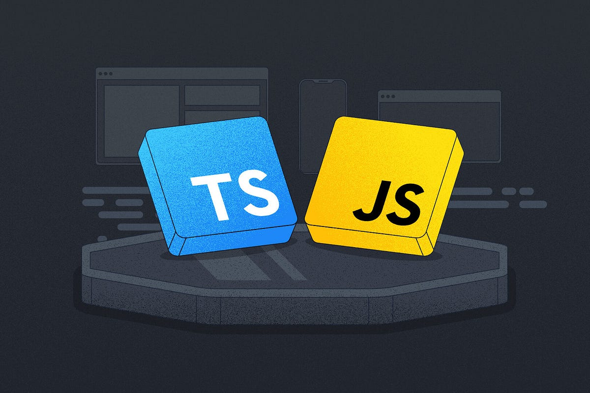

[](https://git.io/typing-svg)


# 👨‍💻 Pedro

**`Estudante Back-end`**
</br>
- 🏴‍☠️ Estou cursando **Defesa Cibernética**🔒🖥️.
- 🔐 Aprendendo sobre **Desenvolvimento Web**.
- 🌍 Idiomas que falo: Português 🇧🇷 e Russo 🇷🇺 (A2 - B1).

  
# Sobre mim 🇧🇷

🔍 Eu passo a maior parte do meu tempo estudando. Adoro estudar sobre **tecnologia**, **edição de vídeos** e principalmente o **idioma russo**, o qual eu amo tanto.


</br>

</br>
<p align="center">
    
 </p>
 
 <br>
 
 ```cs
// bemvindo.js

function mostrarMensagem() {
    console.log("==================================");
    console.log("Olá! Bem-vindo(a)!");
    console.log("==================================");
}
mostrarMensagem();
```

<br/>


<div align="center">
    <b></b>
</div>     

<div align="center">
    <h3>🧑‍💻🔧Linguagens que utilizo</h3>
</div>
<p align="center">
  <a href="#">
    
</p>
<div align="center">
    <h3>💾🐧Sistemas e Tecnologias</h3>
</div>
<p align="center">
  <a href="#">
    
  </a>
</p>

 <br/>

 

</br>

## 🎓 Certificados

| Certificação | Instituição / Plataforma | Status |
|---|---|---|
| Dark Web e Privacidade | XPSec Scurity | ✅ Concluído |
| Formação em Cibersegurança | Hackers do Bem, SENAI - SP | ✅ Concluído |
| Introdução à Cibersegurança | Cisco Networking Academy | ✅ Concluído |
| Analista de Cibersegurança Júnior | Cisco Networking Academy | 🎯 Em andamento  |


 

 <p align="center">
    
 </p>
 
 <br/>
 
 
